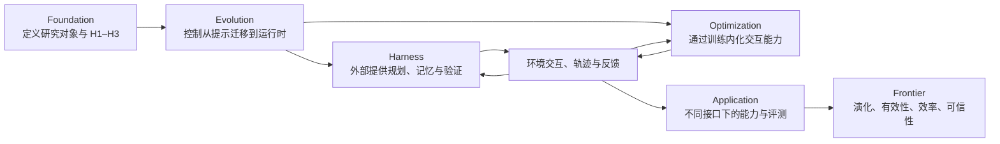

# 《Towards Long-Horizon Agents: A Survey》详细解读

> 阅读基准：作者仓库英文 PDF 的固定快照，共 149 页；下文页码均指该 PDF 页码。检索日期：2026-09-10。本文是中文分析性总结，不是逐句翻译。原文观点、本文解释和批判性判断分别标明。
>
> 原文：Guanting Dong 等，*Towards Long-Horizon Agents: A Survey — Foundation, Evolution, Harness, Optimization, Application, and Frontier*。[预印本及 DOI](https://doi.org/10.20944/preprints202607.1328.v1)；[固定版本仓库](https://github.com/RUC-NLPIR/Awesome-Long-Horizon-Agents/tree/084cafe83e3d10814ae0b63329bd10aa5945fd97)；[本地英文 PDF](sources/Towards_Long_Horizon_Agents_A_Survey.pdf)。Preprints 页面标为未经同行评审的预印本；不能依据 OpenReview 链接推断录用。

## 1. 文章真正试图回答什么

这篇综述的中心问题是：**为什么模型已经很会回答问题，却仍难以可靠完成需要持续交互、跨越上下文和不断修正的工作？**

作者的回答是，长程能力属于整个智能体系统：模型提供决策策略，外部运行系统负责组织行动、保留状态、执行工具、检查结果和恢复失败。两者通过运行经验共同进化。把进步全部归因于更大的模型，或者全部归因于某个提示词、记忆模块，都不足以解释实际系统表现。

这里的 **harness** 可理解为“包围模型的智能体运行与控制系统”。它包括提示、循环、工具、记忆、调度、检查和权限控制，范围比单纯的工具接口更广，也不等同于整个机器学习基础设施。原文明确排除了通常意义上的 GPU 集群调度等基础设施，除非其直接影响长轨迹训练和执行。〔原文 §1–2，pp.4–9〕

全文的逻辑不是按应用罗列智能体，而是形成一条链：

**本文的概括：从“模型生成了什么”转向“系统经过什么状态转移，最终交付了什么”。** 这也是阅读后续章节最有用的视角。

## 2. Foundation：长程到底“长”在哪里

### 2.1 核心是决策依赖，不是耗时或 token 数

原文把长程任务定义为：求解需要组合许多相互依赖的决策，且必须借助环境反馈逐步缩小解空间；初始目标也可能需要在执行中澄清。

例如，“逐个压缩十万个互不相关的文件”可以运行很久，但缺少紧密的决策依赖；“定位一个跨模块错误、修改实现、处理测试反馈并验证兼容性”可能只运行几十分钟，却有明显的长程结构。前一步定位错误，会改变后续编辑、测试和解释的方向。〔§2.1、§2.4，pp.7–14〕

因此至少应区分四种长度：

| 量 | 它说明什么 | 它不能单独证明什么 |
|---|---|---|
| 人类完成时间 | 在指定任务分布上的难度代理 | 模型真实运行了多久 |
| 智能体实际运行时间 | 系统延迟和资源占用 | 是否存在复杂决策依赖 |
| 实际行动步数 | 某条轨迹的执行长度 | 最短必要推理深度；多出的步骤可能是循环 |
| 依赖深度、跨会话依赖 | 后续决策需要保留多少前序承诺和证据 | 全部任务难度；感知、动作空间和反馈也很重要 |

前两列的操作性拆分是本文解释。它提醒我们：研究“长度泛化”时，应控制任务结构，不能只扩大 max_steps。

### 2.2 模型与 harness 耦合的形式化

原文核心公式为：

\[
\mathrm{Agent}=\pi_\theta\oplus\mathcal H.
\]

\(\pi_\theta\) 是基础策略；\(\mathcal H\) 决定调用时机、上下文组织、工具执行、动作检查和状态持久化；\(\oplus\) 表示运行时耦合，而非数值相加。

在环境中，原文使用部分可观测的状态转移描述：

\[
s_{t+1}\sim\Psi(\cdot\mid s_t,a_t),\qquad o_t\sim Z(\cdot\mid s_t),
\]

\[
c_t=\mathcal H(o_{0:t},a_{0:t-1},Q),\qquad
a_t\sim\pi_\theta(\cdot\mid c_t).
\]

其中，\(Q\) 是任务，\(s_t\) 是环境真实状态，\(o_t\) 是可见观测，\(c_t\) 是 harness 整理后交给模型的上下文。轨迹可能因为达到目标、耗尽预算或主动停止而终止；**停止并不等于成功**。任务效用 \(R(\tau)\) 常在最后才出现，形成稀疏、延迟的信用分配问题。〔§2.1，p.9〕

这个形式化有三个实用含义：

1. 同一模型换一套工具、记忆和检查机制，实际上就换了被评估的智能体。
2. 历史摘要不是环境真相。观测本来不完整，摘要还会进一步丢失信息。
3. 某条轨迹失败，可能源于模型动作、工具副作用、状态组织或验收错误，不能直接全部归为“模型推理差”。

**形式化的边界：** 该式是统一抽象，不是能够精确分离模型贡献和 harness 贡献的因果模型。真实运行系统还包括异步事件、工具失败、外部用户修改和多主体并发，需要额外的状态与时间建模。

### 2.3 H1–H3 与 C1–C3

| 层级 | 任务范围 | 所需能力 | 典型失败 | 例子 |
|---|---|---|---|---|
| H1 | 一个上下文内的多步交互 | C1：交互式推理、验证、纠错 | 单点错误沿后续步骤扩散 | 检索多条证据后回答一个复杂问题 |
| H2 | 一个任务跨上下文、会话或交接 | C2：在 C1 基础上持久化状态和记忆 | 摘要丢约束、恢复后重复或跳过步骤 | 跨会话完成迁移、调试和回归检查 |
| H3 | 开放任务流，任务与环境不断变化 | C3：在 C2 基础上积累并复用经验 | 经验失效、错误技能传播、更新后遗忘 | 长期维护项目并把经验迁移到新任务 |

原文用嵌套符号表达能力需求逐层累积。这里不宜把它理解成经过证明的严格难度集合包含关系：实际任务可能跨很多会话但每次决策很简单，也可能在一个窗口里有极深的组合难度。作者也明确说明，上下文边界只是逻辑依赖负担的可观测代理，“分钟、小时、终身”不是定义阈值。〔§2.2，pp.10–11〕

**对研究的启示：** H1 的成绩不能证明 H2；记忆问答成绩不能直接证明跨会话行动；多次任务成功也不能证明 H3 的持续学习。

### 2.4 与三个邻近概念的区别

| 概念 | 回答的问题 | 与长程能力的关系 |
|---|---|---|
| Long-running | 能持续运行多久 | 常需要 checkpoint，但长时间批处理不一定是长程决策 |
| Autonomous | 用户还需要参与多少 | 是控制权分配；高自主不代表高能力 |
| Self-evolving | 经验是否使系统产生持久变化 | 对 H3 很重要，H1/H2 可以使用固定策略完成 |

一个有审批节点的系统仍可以有很强的长程能力；一个完全无人干预的系统也可能只是持续失败。原文在 §2.4 明确保留了人类有选择地纠偏与介入的空间。〔pp.13–14〕

### 2.5 怎样读 time-horizon 增长曲线

原文基于截至 2026-05-08 的 METR 数据讨论增长趋势，报告完整拼接序列约 196.5 天翻倍，2023 年以后子集约 130.8 天翻倍。文章也承认：前后使用 TH1.0/TH1.1 的覆盖不完全一致，不能把两个拟合值的差直接视为“加速”已经得到严格证明。〔§2.3，pp.11–12〕

描述式为：

\[
H(t)\approx H_0\,2^{(t-t_0)/T_d}.
\]

它是在描述特定历史样本中的趋势，不是关于任何任务、模型或预算都成立的能力定律。

核对 METR 原始说明后，应保留三条限制：time horizon 以**人类专家任务完成时间**计量；50% horizon 表示拟合成功率为 50% 的位置；主要任务是可独立验收的软件、机器学习和网络安全任务。当前套件对超过 16 小时的估计不可靠。这些数值不能解释为“智能体能稳定无人值守工作十几小时”。[METR 方法说明](https://metr.org/time-horizons/)

METR 后续方法审计也指出，任务分布、拟合方式和人类工时估计都会显著影响结果。本文据此建议，在研究报告中同时提供置信区间和任务分布，避免只展示最有传播性的单个时长。[METR 方法敏感性分析](https://metr.org/notes/2026-03-20-impact-of-modelling-assumptions-on-time-horizon-results/)

## 3. Evolution：控制机制为什么从提示迁移到运行时

原文把发展过程分为三个相互重叠的阶段，年份是作者的组织框架，不意味着后一阶段替代前一阶段。〔§3，pp.15–20〕

| 阶段 | 控制对象 | 代表机制 | 解决了什么 | 留下什么 |
|---|---|---|---|---|
| Prompt engineering，2020–2023 | 单次调用的指令与推理模式 | CoT、分解、Plan-and-Solve、自我修订 | 激发模型已有能力 | 缺乏跨调用状态、可执行约束和可靠恢复 |
| Context engineering，2023–2025 | 每次调用可见的信息 | 检索、摘要、结构化上下文、记忆 | 让模型在需要时获得证据 | 仍需有人或外层系统管理整个执行过程 |
| Runtime harness，2025 至今 | 完整的行动轨迹和生命周期 | 持久任务状态、工具执行、检查、交接、恢复 | 使长任务可控制、可追踪、可恢复 | 运行系统自身复杂、依赖模型习惯、可能过拟合 |

外部机制常先把一个弱能力补起来：例如通过显式规划让模型少走弯路；随后再用这些运行轨迹训练模型，让它更自然地规划。模型变强后，原来复杂的流程可能简化，也可能支持更复杂的新流程。这就是“外化—内化—再外化”的共同演化。

**本文判断：** 这一框架解释了为什么只比较“模型排行榜”不够，也解释了为什么“某种固定 agent 架构永远最佳”不可信。模型、工具与任务改变后，最有效的控制结构也可能变化。

## 4. Harness：六类外部机制逐项解读

### 4.1 Loops and workflows：把执行组织成可检查的过程

原文区分三类结构。〔§4.1，pp.20–23〕

| 结构 | 运行方式 | 适用条件 | 主要代价 |
|---|---|---|---|
| 线性循环 | 观察—行动—反馈，维持一条轨迹 | 环境反馈频繁，需要快速响应 | 错误污染后续上下文，容易陷入重复 |
| 计划—执行 | 显式维护子目标、依赖、完成标记和重规划 | 任务有可追踪的中间阶段 | 计划可能过时，错误完成标记会误导后续工作 |
| 分支搜索 | 生成多个候选，比较、剪枝、回溯 | 早期承诺昂贵，局部结果可验证 | 成本扩大；有副作用的环境不易复制分支 |

ReAct 是基本循环的代表；ReWOO、Arbor 等体现计划的外部化；ToT、LATS 体现候选路径搜索。关键不在名字，而在**谁决定下一步、谁判断完成、失败后从哪里继续**。

作者特别强调 maker–checker 分离：产生结果的过程不应成为唯一验收来源。这个原则能降低自我评估偏差，但本身不保证 checker 正确。分支之间如果共享相同错误证据，增加分支也可能只是增加一致的错误。

### 4.2 Context and memory：维护将影响未来行动的状态

原文区分当前工作上下文与跨窗口、跨任务的持久记忆。〔§4.2，pp.23–26〕

**工作上下文有三种操作：**

- **Discard：** 删除过期、冗余、无关信息，也包括在输入前裁剪不需要的工具定义。
- **Compress：** 把长工具返回或整段历史变为较小的状态表示。
- **Select：** 把完整信息放在外部，根据当前决策再检索。

好的压缩需要保留已完成决策、尚未完成的子目标、有效约束、失败原因和产物位置；“摘要读起来通顺”并不是充分条件。检索也不仅来自外部文档，还来自智能体自己的行动轨迹。

**持久记忆有两类内容：**

- 事实记忆：用户偏好、项目约束、对象关系、稳定环境事实。
- 经验记忆：失败教训、成功策略、工作流、可复用代码技能。

它又有写入、维护、检索三个生命周期环节。维护尤其重要：旧事实需要失效，冲突事实需要辨别，重复经验需要合并，危险经验需要隔离。只有“向量库 + top-k”通常无法完整表达这些操作。

原文收录 ReSum、MemAgent、MEM1、MemGPT、MemoryOS、A-Mem、ReasoningBank 等，显示研究已从保存对话扩展到学习记忆操作、保留过程和复用技能。**真正的评价对象是记忆有没有在正确时机改善后续行动，而不只是能否答出一个旧事实。**

### 4.3 Tools、MCP、skills：连接能力与程序性知识

三者分别回答不同问题。〔§4.3，pp.26–29〕

| 层次 | 核心作用 | 长程任务中的额外要求 |
|---|---|---|
| Tool / function call | 执行一个可定义的外部操作 | 输入合法、结果可信、副作用可观察 |
| MCP 等协议 | 统一发现和访问异构工具的接口 | 版本变化、授权、跨服务状态和错误语义 |
| Skill | 封装“如何组合工具完成一类事情” | 前置条件、适用范围、失败处理、版本和退役 |

工具很多时，全部写进提示会挤占上下文。原文讨论主动工具发现、按需加载 schema，以及 CodeAct 一类用代码组合工具的方法。这些机制能减少上下文负担，但也扩大可执行代码的治理需求。

技能可以是自然语言操作说明、可执行程序或结构化技能图。它与经验记忆有重叠，区别主要在可操作性与复用方式，而非文件后缀。Voyager、Agent Skills、SkillNet、SkillRL 等说明，技能的获取、组织和演化已经是成熟研究方向，不能简单把“自动生成 SKILL.md”当作新的长程算法。

### 4.4 Orchestration：组织协作，同时控制协调成本

原文讨论四个问题：任务如何分解、采用什么连接结构、结构如何优化、参与者如何交换消息和产物。〔§4.4，pp.29–31〕

常见结构包括中心协调者、层级组织、对等协作，以及表达依赖的图。AFlow、GPTSwarm 等进一步尝试搜索工作流或优化图结构。

长程协作困难来自：

1. 子任务划分不完整，或者重复覆盖同一问题。
2. 不同 agent 对目标、对象版本和完成标准理解不一致。
3. 某个子任务的错误产物被其他参与者当作事实。
4. 通信、合并和重复验证吞掉并行收益。

原文认为，很多“多角色”收益实际来自并行、上下文隔离和工具专门化，而非角色人设。**本文的工程解释：应按可独立验收的工作单位分解，明确共享对象和写入权，再决定是否增加 agent。**

### 4.5 Hooks and middleware：在动作路径上执行约束

原文把 hook 理解为执行生命周期上的拦截点，可允许、阻断、暂停或交接动作。它分三类。〔§4.5，pp.31–34〕

| 类别 | 约束来源 | 机制与边界 |
|---|---|---|
| 预定义规则 | 框架维护者设定 | 输入、工具调用、协议边界上的固定检查 |
| 用户定义 | 部署者的领域要求 | 可由形式规则执行，也可由模型编译或在线判断 |
| 运行时自适应 | 不确定性、行为异常、威胁变化 | 能适应新风险，但触发本身也有误报与漏报 |

用户定义约束还可分为：直接写形式策略；把自然语言策略离线编译成检查代码；让模型在运行时解释策略。三者在表达成本、灵活性和保证强度之间取舍。

需要谨慎理解“形式保证”：确定性检查能够保证的是**已编码策略在明确假设和完整拦截范围内的执行**。它不自动保证自然语言需求编译无误、所有工具副作用都被建模，或部署环境不存在绕过路径。不能从“使用 SMT / DSL”直接推出整个智能体安全。

### 4.6 Verification：检查什么、何时检查、如何获得可信信号

原文给出三个正交维度。〔§4.6，pp.34–37〕

| 维度 | 分类 |
|---|---|
| 验证对象 | 正确性、安全性、指令忠实性、多方交叉验证 |
| 时间粒度 | 步骤级检查、整次任务结束后的验收 |
| 验证策略 | 自动标签与隐式奖励、验证器引导搜索、按难度分配验证计算 |

软件中有测试、编译和执行反馈；检索中需要证据支持与来源核验；GUI 中常需重新观察实际页面状态；开放式报告则更多依赖 rubric、专家和工具增强的评估者。

这里最值得吸收的观点是：**hook 提供实施位置，verifier 提供判断依据，两者共同构成反馈闭环。** 一个 verifier 只打分却不改变执行，对早期错误传播可能帮助很小；一个 hook 坚决拦截却没有可靠判断，也可能阻碍正常任务。

自我反思、多个模型一致和最终文本看起来合理，都只能提供有限证据。可信的运行闭环应尽量连接环境事实、可执行后置条件和独立验收。

## 5. Optimization：如何把外部能力内化进模型

这一章按“架构基础 + 六个能力形成环节”组织，并非要求每个智能体都完整执行七段训练。〔§5，pp.37–55〕

### 5.1 架构基础：可表示、可训练、可承担成本

| 设计 | 优点 | 局限 |
|---|---|---|
| 显式上下文与 attention | 历史 token 可以被精确访问 | 长上下文带来计算、KV cache 和信息定位成本 |
| 压缩状态、递归、SSM | 适合流式更新，状态成本可控 | 稀有细节和精确旧字符串可能难以恢复 |
| 混合结构 | 结合精确访问与低成本状态跟踪 | 需要设计两类记忆如何协作 |
| 吞吐机制 | speculative decoding、GQA、KV 压缩等降低执行成本 | 不能单独解决目标保持和环境正确性 |

原文特意指出：MoE 主要改变容量与计算分配，不是一种独立的历史存储机制；MLA 是逐 token 的低秩 KV 表示，也不能直接等同于固定大小的递归记忆。FlashAttention 降低访存成本，但没有因此获得长期项目状态。〔§5.1，pp.37–40〕

### 5.2 数据与环境合成：训练对象是可执行经验

原文把合成分成三层。〔§5.2，pp.40–43〕

**任务合成：** 通过子目标依赖链、证据图、初始到目标状态的差异和能力自适应课程构造任务。真正增加 horizon 应增加必要的跨步骤依赖，而非把无关任务拼接得更长。

**环境合成：**

- 可执行的符号环境：数据库、文件系统、程序、真实网页副本。
- 神经环境：用模型预测文本、视觉或潜在状态。
- 混合环境：硬状态和验收由程序控制，用户语言等由模型模拟。

**轨迹合成：** 保存动作、观测、状态变化、错误和验证来源；从教师示范、学生 rollout、失败修复和经验压缩中获得训练样本。

主要矛盾是可扩展性与保真性：生成大量看似真实的交互很容易，但生成准确的状态转移和可信的奖励更难。一个训练环境如果默认工具永远成功，就不会教会系统处理重复提交、延迟返回和实际未生效。

### 5.3 预训练与中期训练：形成交互能力的基础

作者讨论推理先验、长上下文状态建模、多模态感知和数据混合。代码与数学提供结构化依赖；长序列训练使模型接触远距离约束；视觉训练影响 GUI 定位；数据配比决定这些能力的覆盖。〔§5.3，pp.43–45〕

**关键区别：** 接受长输入、生成长输出、执行长任务是三种不同能力。最大窗口变大后，模型仍可能不会利用旧证据；模型会长篇推理后，也可能不会正确处理一次工具失败。

### 5.4 SFT 与离线蒸馏：建立可执行的行为基础

SFT 教会模型规划、工具格式、观察解释、修复和终止。原文强调高质量决策点覆盖、任务混合和课程，而不是只追求轨迹数量或盲目追求小数据。课程可以沿长度、难度、工具复杂度和反馈稀疏程度展开。〔§5.4，pp.45–47〕

离线蒸馏既包括强教师到弱学生，也包括模型生成、过滤、反思自己的历史轨迹。应保留过程结构和错误恢复，而非只复制答案。

局限在于学生会进入示范中没有的状态。专家成功轨迹告诉学生“正确路径如何走”，却未必告诉它“自己走错后如何恢复”。这引出 RL 和 OPD。

### 5.5 Agentic RL：四个相互影响的设计维度

**第一，信用从哪里来。** Outcome reward 依据最终成功，容易执行但粒度粗；process reward 给步骤或子目标反馈，但标签可能有偏；rubric reward 适合多维开放任务，但引入评分者偏差、权重和奖励投机问题。三者不是谁必然优于谁，而是监督可靠性与成本的取舍。〔§5.5.1，pp.48–50〕

**第二，如何稳定更新。** PPO/GRPO 及其变体处理 clipping、归一化、长序列偏差、全对/全错组、重要性比率和熵塌缩。决策粒度从 token/response 扩展到 turn、step、subgoal；相同终局奖励不能直接说明每一步都值得强化。〔§5.5.2，p.50〕

**第三，采什么轨迹。** 独立完整 rollout 成本高；树采样共享前缀并比较分支；预算控制、困难样本选择和长度课程提高每次环境交互的信息量。分支越多并不总是越好，因为环境复制可能昂贵或不准确。〔§5.5.3，pp.50–51〕

**第四，训练什么交互结构。** 分层 RL 分开规划和执行；多智能体 RL 面临协作信用分配和非平稳性；memory-state learning 把记忆读写、删改和流程组织变成可学习动作。〔§5.5.4，pp.51–52〕

值得注意的是，记忆动作会改变之后的“有效环境”。如果两个 rollout 写入了不同记忆，就不能只因任务名称相同而认为中间状态可直接比较。原文通过 Memory-R2 等工作把这个问题纳入长程训练的核心。

### 5.6 OPD：在学生自己访问的状态上接受指导

| 方法 | 状态主要由谁产生 | 监督来源 | 主要弱点 |
|---|---|---|---|
| 离线模仿 | 教师或既有数据 | 固定示范 | 学生分布偏移 |
| Agentic RL | 当前或近当前学生 | 环境回报、验证器、rubric | 探索成本与信用分配 |
| OPD | 当前学生 | 教师或增强条件下的自身分布 | 教师在错误前缀上也可能不可靠 |

原文把 OPD 分为两类。Teacher-guided OPD 在学生状态上调用一个或多个教师，可调整指导时机、粒度和课程。Self-improving OPD 使用训练时特权信息、环境反馈、反思或更强推理条件构造监督，再把能力蒸馏回部署策略。〔§5.6，pp.52–53〕

**最容易误读的地方：** “on-policy”保证学生状态被看见，不保证教师知道如何在所有这些状态上正确行动。长任务中一个早期错误可能让后面的教师分布、奖励和可达目标都发生变化；token 级密集指导不等于语义上正确的恢复指导。

本文把这条矛盾进一步发展成具体研究问题，见 [问题分析](02_亟需解决的问题与研究机会.md)。该部分结合了 TCOD、SOD、f-OPD 等原始论文，而不是认为综述提出的 OPD 路线已解决训练稳定性。

### 5.7 自演化：让经验改变后续的能力形成过程

原文分为三种形态：离线 generate–filter–train；在线交互与更新交替；智能体、任务和环境共同调整难度。外部记忆和技能可以先保存经验，再通过训练内化。〔§5.7，pp.53–55〕

这条路线的潜力是减少静态数据依赖；风险是把当前系统的偏差持续强化。验证器有漏洞时，演化可能逐渐学会利用漏洞；课程只根据当前成功率变化时，也可能窄化为最容易获得奖励的任务。

因此“越运行越好”至少应拆成：当前任务更好、同分布下一批任务更好、未见任务更好、旧任务不退化、约束不被削弱。这些不是同一个实验结论。

## 6. Application：接口决定困难与验收方法

原文按 agent–environment 接口划分五类，目的在于解释能力差异，而非做严格互斥分类。一个科研智能体可能同时属于多个类别。〔§6，pp.55–67〕

| 类别 | 可见信息与动作 | 需要长期保留的状态 | 主要反馈缺口 |
|---|---|---|---|
| 软件工程 | 代码、终端、编译器、测试 | 依赖、需求、补丁、失败记录 | 测试通过未必符合真实需求与可维护性 |
| 信息搜寻 | 搜索结果、网页、文档 | 证据、来源、未解问题、覆盖范围 | 缺少统一 oracle；答案看似合理但证据可能不支持 |
| 计算机使用 | DOM、截图、GUI、移动应用 | 账户、界面状态、已发生副作用 | 页面显示与后台真实状态不一定一致 |
| 多模态 | 图像、音视频、文本、生成工具 | 时间段、区域、跨模态指向和版本 | OCR、对齐、摘要和渲染都可能引入错误 |
| 通用智能体 | 多应用、多权限、多服务 | 长期目标、用户承诺、跨应用依赖 | 任务开放、不可逆操作多、成功标准异质 |

软件工程细分为仓库定位、工作流规划、反馈修复；信息搜寻细分为深搜、广搜、多模态 grounding 和研究综合；计算机使用区分浏览器、桌面与移动端；多模态区分理解、生成与 omni；通用智能体进一步涉及个人助手、具身及专业生产工作。

科研例子很有启发：假设、程序、实验记录、结论与论文都应视为不断变化的研究状态。新实验推翻一个假设时，不仅下一段文本需要修改，之前的图、摘要和下游论证也可能失效。〔§6.5.3，p.64〕

### 6.1 评测资源应怎样使用

原文表 7 同时列出系统和 benchmark，不能把每一项都视作严格的长程任务测试。作者明确说明，一些视频理解 benchmark 只是感知能力基础测量。〔§6.6，pp.64–67〕

本文建议按研究对象选择组合：

- 单任务复杂执行：SWE-bench Pro、Terminal-Bench、WebArena、OSWorld。
- 跨会话记忆对行动的作用：MemoryArena 等明确建立会话间依赖的任务。
- 用户、工具与规则协同：τ-bench、AppWorld。
- 跨文件和长期计划：Workspace-Bench、YC-Bench。
- 系统贡献归因：固定任务与预算，交叉更换模型和 harness。
- 安全：分别测恶意请求、间接注入、记忆污染和合法任务中的策略违规。

这是一组研究组合建议，不是统一排行榜；具体来源与读取深度见 [仓库地图](03_仓库地图与研究方案.md)。

## 7. Frontier：原文的四条主线、九个开放方向

以下忠实概括原文表 8 和 §7，尚未加上本文自己的优先级。〔pp.67–74〕

| 主线 | 方向 | 原文诊断 | 原文提出的推进路线 |
|---|---|---|---|
| Evolution | 自演化 harness 与 agent | 目标人为设定、域外收益有限、长期过拟合和漂移 | 自动发现能力缺口，决定修改范围，长期稳定演化 |
| Evolution | Harness 泛化与迁移 | 模型绑定某套运行机制，跨搭配表现不稳定 | 可移植经验、多 harness 训练、共同接口和观测协议 |
| Evolution | 持续与终身学习 | 外部经验噪声大，参数更新容易遗忘 | 先外部验证经验，再选择性固化到权重 |
| Effectiveness | 真实环境交互 | 交互慢、贵、部分不可逆；模拟不保真 | 可验证环境与模型模拟结合，显式审计保真度 |
| Effectiveness | 数字到具身 | 慢规划与快控制冲突，物理模型不足，反馈尺度不一 | 异步分层控制、动作条件世界模型、多尺度验证 |
| Efficiency | 成本与预算感知 | 缺少校准的成本预估、不可行判断和硬预算约束 | 预测—调整—强制执行—研究预算与成功率关系 |
| Efficiency | 多模态与 omni harness | 感知像附加工具，视觉预算和跨模态验证依赖启发式 | 原生视觉状态、按模态粒度保留证据、提前检查和路由 |
| Trustworthiness | 反思与错误鲁棒性 | 错误发现晚，内部自我纠错不可靠，目标漂移 | 早期检测与换路、外部验证、校准求助、人类纠偏学习 |
| Trustworthiness | 安全与治理 | 注入与危险经验复用、缺少统一验收、自修改削弱约束 | 来源追踪、经验使用门槛、行动安全评价、独立不变量检查 |

作者尤其强调三个连接点：外部经验何时可以内化；运行机制如何迁移到别的模型；在真实环境里如何得到可靠反馈。它们比单个模块性能更接近长程能力的系统性瓶颈。

## 8. 对这篇综述的评价与必要修正

### 8.1 主要价值

1. **研究对象清楚。** 把长程定义为耦合决策，并区分持续运行、自主性和自演化。
2. **贯通工程与训练。** 记忆、skills、harness 不再只是部署技巧，而是训练数据和能力内化的一部分。
3. **强调过程与状态。** 关注实际动作、副作用、验证和恢复，超出了最终答案评价。
4. **分类可用于定位选题。** 可以问一项方法服务 H1/H2/H3，改变哪种状态、哪个反馈环节。

### 8.2 不能从文章直接得到的结论

- **它不是同条件实验大比较。** 大量论文、产品文档和代码资源的证据强度不同；综述没有替它们统一复现。
- **它不是完整的长度复杂度理论。** 没有建立依赖图深度、反馈延迟、恢复成本与成功率之间普适的定量关系。
- **它没有解决各模块贡献归因。** “模型 + harness”是必要的视角，仍需要受控实验来测交互效应。
- **它的开放问题是作者立场。** “环境构造是下一阶段的限速项”等表达应作为研究判断，不能当成已证实的全领域定律。
- **它没有给出生产级可靠性的统一证据。** benchmark 分数、稳定交付、可恢复性和安全不能互相替代。

### 8.3 三处阅读时应主动澄清的边界

**第一，终身学习不是所有长程任务的必要条件。** §2.4 明确允许固定策略完成 H1/H2；§7.1.3 的强表述应限于作者期望的 H3 持续改善目标，不能反过来否认固定策略的长程能力。

**第二，自修改代码不等于更新权重。** §7.1.1 在讨论更强的自演化时提到 DGM，但 DGM 原文明确以冻结基础模型改进 coding-agent 代码和工作流为主要实验。不能把它列为“已经证明运行技能成功内化进权重”的证据。[DGM 原文](https://arxiv.org/html/2505.22954v1)

**第三，检查的确定性不等于端到端正确性。** 程序化检查只覆盖明确规则、可观察状态和受控接口；多个 checker 也可能共享同一盲点。本文后续研究机会因此把验证器自身的校准与失效传播作为重点。

由这篇综述最值得带走的研究问题是：**如何让决策所依据的状态，在长轨迹、跨会话、工具变化和学习更新后仍然真实、有效、可验证，并让系统在做错之后能够有限成本地恢复。** 具体优先级和可检验假设见 [问题分析](02_亟需解决的问题与研究机会.md)。
