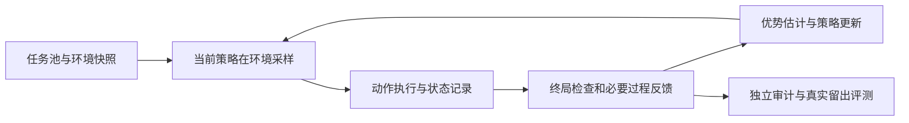

# 长程智能体：场景、数据合成、质量校验与训练路线

> 检索日期：2026-09-10。针对三个问题：有哪些场景、如何采集/合成数据；怎样判断数据质量、LLM-as-a-Judge 是否足够；有了数据后怎样训练。
>
> 仓库基准：[Awesome-Long-Horizon-Agents 固定快照](https://github.com/RUC-NLPIR/Awesome-Long-Horizon-Agents/tree/084cafe83e3d10814ae0b63329bd10aa5945fd97)。本次重新核对 `main`，仍为该 commit。`Rxxxx` 对应[本地条目索引](../long-horizon-1/data/repository_catalog.csv)。下文明确区分**原论文已有能力、其证据边界、本文建议**。没有在有限检索中发现某种组合，不等于证明全领域无人研究。

## 0. 直接回答

1. **数据应按“交互接口 + 交付物 + 跨时间依赖”组织。** terminal、computer use 是接口；writing 是目标。同一篇论文的维护可能同时使用终端、浏览器和编辑器。共同的数据骨架可以统一，环境、观测、动作和成功判准必须按场景保留。
2. **合成对象有任务、环境、轨迹、反馈四层。** 有价值的流水线是“真实种子/可执行状态 → 任务与环境生成 → agent 实际执行 → 独立验证 → 数据分流”。LLM 可以出题、扩展依赖、生成代码和语义 rubric；工具结果与研究事实需要独立依据。
3. **LLM-as-a-Judge 是语义评价器之一。** 应与程序检查、状态核验、来源证据和专家审计结合。格式通过、judge 高分、最终答案碰巧正确、训练后真实收益，是四种不同证据。
4. **训练方式取决于数据能支持什么。** 只有完整稿件适合内容建模；有观察—动作轨迹才能模仿决策；有相同起点的可靠偏好对才能做偏好优化；有可运行环境和可信反馈才能持续采样做在线 Agentic RL；有学生访问状态与可靠教师才适合 OPD。
5. **最值得补的是连接处。** 仓库已经覆盖数据生成、judge、人审、SFT/RL、记忆和长程诊断。剩余机会在“跨接口状态一致的长期事件数据”“持续受策略优化检验的 verifier”“真实科研材料变化下的写作训练”等更具体的任务上，见第 5 节。

## 1. 场景到底有哪些，分别需要什么数据？

### 1.1 用三个坐标描述场景

| 坐标 | 可选值 | 为什么影响数据 |
|---|---|---|
| 交互接口 | terminal、代码编辑、API/MCP、DOM、截图/鼠标、音视频、机器人动作 | 决定观察与动作表示、环境能否重放、模型是否需要视觉输入 |
| 工作目标 | 修复代码、完成业务事务、检索调查、写作修订、数据分析、实验研究、物理操作 | 决定最终成功判准和需要保留的产物 |
| 时间结构 | 单上下文 H1、跨窗口/会话 H2、连续任务流 H3 | 决定是否必须记录持久记忆、外部变更、用户承诺与经验迁移 |

例如“完成系统迁移”可能涉及 CLI 和云 API；“根据新实验更新论文”涉及 CLI 分析、网页取证、LaTeX 编辑和 PDF 检查。强制把它们切成互不相交的行业数据集，会丢失接口之间的依赖。

### 1.2 场景与数据矩阵

下表是数据建设建议，不是原综述的逐字分类。

| 场景 | 采集的原始材料 | 轨迹必须保存 | 合成的主要方式 | 核心验收 |
|---|---|---|---|---|
| **Terminal / 运维 / 数据处理** | 容器镜像、安装脚本、故障工单、命令记录、输入文件 | cwd、环境版本、命令、stdout/stderr、退出码、超时、文件与服务状态变化 | 对健康环境做受控破坏；从任务技能构造环境；变换输入、依赖与权限 | 隐藏测试、文件内容、服务健康、输出数据和副作用 |
| **软件工程** | issue、修复前 commit、PR、测试、依赖锁定 | 检索、补丁、构建/测试结果、失败与修复、最终 diff | 真实 issue 重放；受控 bug；测试驱动任务变体 | 原缺陷确实修好、回归通过、未篡改测试/绕过需求 |
| **Computer use：网页/桌面/移动** | 授权操作演示、测试账户、初始应用/数据库、真实任务描述 | 操作前后截图、可用时的 DOM/可访问性树、分辨率、动作、焦点、等待、应用后台状态 | 真实应用任务参数化；自动探索；可执行网站/FSM 生成；布局和数据变化 | 数据库/文件后置条件、应用状态与渲染结果共同核验 |
| **API / 企业工作流** | API schema、测试数据库、规则、授权业务日志 | 请求/响应、调用 ID、事务状态、幂等键、用户补充与权限 | schema 驱动任务和数据库生成；跨应用依赖；故障注入 | 目标事务完成且约束满足，无重复或越权副作用 |
| **信息搜寻 / Deep research** | 固定网页/PDF语料、文档版本、真实研究问题 | query、排名、打开的内容、证据片段、反证、引用与回答 | 证据图反向出题、多跳依赖扩展、离线搜索环境、教师执行 | 答案正确、证据支持、覆盖必要信息、引用版本有效 |
| **事实性 writing：论文/报告维护** | 代码、数据、配置、运行产物、文献、旧稿、作者修改、审稿意见 | 每次编辑前状态、触发事件、证据定位、patch、重算/编译、作者接受/拒绝 | 真实材料到初稿；结果/文献变更；受控错误与局部修复 | 实际稿件和图表符合证据，变更传播完整，保护范围未破坏 |
| **创意 writing / 内容制作** | 授权稿件、创作 brief、角色设定、编辑历史、读者反馈 | 长篇结构、人物/设定状态、修订目的、受众偏好 | 情节约束、局部改写、跨章一致性任务、人类偏好对 | 约束一致、编辑意图、盲评偏好；不存在单一事实 oracle |
| **科研实验 / 多模态 / 具身** | 实验协议与仪器日志，或图像、音视频、传感器、模拟器状态 | 时间同步、多模态指向、动作、实验配置、物理/计算状态 | 可执行实验、仿真随机化、可控任务组合、真实少量校准 | 独立实验/测量、物理约束、结果可复现、真实迁移 |

**特别注意：** 记录后台状态用于训练标注或评测，不表示允许部署策略直接读取后台真值。比如截图型 GUI agent 的输入只能是协议允许的截图；DOM、数据库可以留给评估者。否则训练评测测到的是另一种能力。

### 1.3 一个训练样本应包含什么？

建议将“任务包”和“执行记录”分离。任务包可以反复运行，执行记录是某个策略在某次运行中的结果。

```text
task_bundle
  provenance: source, license_or_consent, parent_task_id, project_family
  task: request, required_outcomes, constraints, allowed_tools, budget
  environment: image_or_snapshot, tool_versions, data_versions, reset_spec
  observation_contract: actor-visible fields, evaluator-only fields
  temporal_structure: dependency_edges, session_boundaries, event_schedule
  evaluation: hidden_checks, evidence_references, rubric_version

episode
  task_id, actor_version, harness_version, seed, start_snapshot
  steps[]:
    actor_observation_ref, actor_action, tool_result_ref, execution_status
    timestamp, async_operation_id, parent_step_ids, artifact_diff_ref
    memory_read_write, tokens, elapsed_time, direct_cost
  end_state_ref, termination_reason, evaluator_version, labels
```

此结构是建议的逻辑字段，不声称替代现有协议。较大的截图、视频、网页和文件差异应独立存储并用内容 hash 引用。完整系统快照与 agent 可见上下文必须分开；异步调用还要保留因果关系，时间顺序本身不足以判定哪个结果导致哪个动作。

至少分开保存四类标签：`task_validity`（题目成立吗）、`transition_validity`（记录的转移真实吗）、`outcome`（完成了吗）、`preference`（人更喜欢哪一个）。不要把它们压成一个 `quality_score`。

### 1.4 三条可落地的采集/合成流水线

#### A. Terminal：从能运行的环境构造可修复故障

以“修复每日数据汇总并生成正确报告”为例：

1. 固定容器、依赖、输入数据和已验证参考输出；独立编写需求检查。
2. 注入路径错误、字段变化、重复数据、时区问题等**有任务依据的变更**，保存变化前后状态。
3. 验证初态不满足目标；参考解或独立求解者能完成。原始逆补丁只是一个解，不要求 agent 必须复制它。
4. 让教师/专家在故障环境实际执行，保存命令、输出、文件变化和尝试失败。
5. 加入学生策略运行，重点收集其真实错误前缀及后续纠正。
6. 留出从未出现过的项目和故障组合；同一故障种子的全部变体放在同一 split。

仓库已有 **CLI-Gym** 的环境反演、**Terminal-World** 的 skills 驱动生成和 **SWE-Gym** 的真实代码环境。它们说明“任务+可运行环境”已是成熟方向；本建议额外要求长期事件链和错误恢复标注，是否有收益要单独实测。[CLI-Gym](https://arxiv.org/html/2602.10999v1)；[Terminal-World](https://arxiv.org/html/2605.20876v1)；[SWE-Gym](https://arxiv.org/html/2412.21139v1)。

#### B. Computer use：让动作落到可观察的应用状态

以“把结果导入表格，生成图表并导出文件”为例：

1. 记录授权的人类或教师操作，同时保存应用版本、初态数据和每次动作前后的界面。
2. 参数化表名、数据、布局、窗口大小和文件位置；变更后重新执行，不能只替换旧轨迹中的坐标。
3. 对“点击成功”“正在保存”“数据已保存”分别标注；验收读取真实文件/应用状态。
4. 合成 loading、弹窗、焦点变化、保存延迟等有明确环境语义的分支。
5. 同一后台数据可生成 DOM 型和截图型任务，但训练输入按照各自协议裁剪。
6. 在未参与生成的真实应用或版本上评价，测生成环境到真实环境的落差。

**AgentSynth** 已联合生成任务、解法和验证器并进行人审；**AutoWebWorld** 已从有限状态机生成可执行网页环境。生成页面可运行并不自动证明其布局、异步行为和失败分布代表真实网站。[AgentSynth](https://arxiv.org/html/2506.14205)；[AutoWebWorld](https://arxiv.org/html/2602.14296v1)。

#### C. Writing：从真实材料与修订事件生成任务

论文/事实报告建议分别建设两条数据线。

**初稿线：** 授权项目材料 → 独立重算/核查 → 可支持的主张及适用范围 → 大纲与引用 → 正文和图表 → 编译/语义审查。最终已发表论文只能作为参考产物，不能反向把论文中所有数字都认定为已验证的实验事实。

**变更线：** 固定旧稿和旧证据 → 注入一个明确事件 → 重新执行必要分析 → 维护所有受影响产物。可选事件包括新 run、聚合脚本修正、文献更新、作者锁定某段、审稿人要求新消融、实验文件缺失。

每个事件保存：触发事实、哪些主张已失效、必须更新的正文/表格/图注、必须保护的区域、允许的多种正确处理。若缺少数据，正确动作可以是提出补证或保留未知，不能把所有样本都标成“必须交付肯定结论”。

例如旧稿宣称方法提高准确率；新跑出的结果消除了优势。目标不是“把 90 改成 88”这么简单，而是重新判断比较结论，更新摘要、结果、图表和局限。**合成的是任务事件；实验数值来自实际运行或明确标识的模拟过程。** 模拟数值适合练习计算与同步，不代表获得了真实科学结论。

Deep research 问答只覆盖这条流程的一部分：**OpenResearcher** 在离线语料中实际执行 `search/open/find`，训练用最终答案正确的轨迹，适合搜索冷启动；它没有以“真实项目连续变更后的多文件论文维护”为验收目标。[OpenResearcher §3–4](https://arxiv.org/html/2603.20278)。本地写作方案的材料接入和变更契约见 [paperA/05](../paperA/05_高可用论文写作Agent建设方案与Agentic_RL奖励设计.md)。

## 2. 数据合成有哪些方法？怎样避免只把任务做长？

### 2.1 四种合成对象不可互相替代

| 对象 | 生成内容 | 需要验证 |
|---|---|---|
| 任务合成 | 目标、约束、输入、子目标依赖 | 信息充足、可解性、无捷径、符合真实需求 |
| 环境合成 | 数据库、容器、网站、工具、模拟器 | 状态转移、动作前置条件、副作用、重置和观测保真 |
| 轨迹合成 | 特定策略实际得到的观察和动作 | 动作真实执行、前后状态吻合、无答案泄漏 |
| 反馈合成 | 单步/终局标签、rubric、偏好与纠错 | 来源可信、评价对象明确、对隐性错误有检测能力 |

“LLM 编了一段用户—工具—assistant 对话”最多是一段**模拟轨迹**。只有在具有可信转移模型的环境中执行并验证，才能把它用于行动正确性监督。纯语言模拟仍可用于用户表达、对话多样性或探索，必须保留其来源标签。

### 2.2 方法地图

| 方法 | 做法 | 仓库中的相关工作 | 主要失效风险 |
|---|---|---|---|
| 真实任务重放/挖掘 | 从工单、issue、授权操作及项目版本中恢复任务 | SWE-Gym、AppWorld | 日志缺初态、无失败样本、最终补丁不代表完整决策过程 |
| 环境反演 | 从合法终态或可工作项目构造故障初态，再生成恢复目标 | CLI-Gym | 破坏模式过窄，恢复原文件成为捷径 |
| 技能驱动生成 | 从技能描述提取要求，生成任务、依赖、环境和验证器 | Terminal-World | 生成器与验证器共享错误理解 |
| 证据图/依赖图扩展 | 用前序输出作为后序工具输入，扩展深度、宽度和约束 | TaskCraft、WebShaper | 文字上有多跳，实际上可绕过；只增加并行子题 |
| 程序/FSM 环境生成 | 编写具有状态机和可执行后端的任务世界 | AutoWebWorld | 合法转移不等于真实业务语义；视觉与后台不一致 |
| 环境探索后反向出题 | 先探索可用工具/网页，再基于可达状态提议任务 | AgentSynth 等 | 倾向出教师容易完成的题，忽视开放问题 |
| 固定语料中的教师执行 | 锁定搜索环境并采样真实多轮轨迹，验证后做模仿 | OpenResearcher | 答案可得性偏强，真实网页变动和证据缺失被弱化 |
| 失败与反事实生成 | 从同一快照注入故障，生成错误、纠正和对照分支 | Agent-R 的错误恢复轨迹、Memory-R2 局部重采样、OPD 学生状态监督 | 拼接后的后续观察不再符合新动作；把任务无解误判为策略差 |
| 课程/自适应生成 | 根据学生表现选择依赖深度、难度、记忆或工具预算 | AgentGym-RL、TCOD；综述 §5.2/5.5 | 出题器追逐奖励漏洞，难度与反馈错误混淆 |

**TaskCraft** 已用深度/宽度扩展和工具必要性筛选，并检查信息泄漏；因此不能把“合成多跳任务”直接作为创新点。**WebShaper** 已用结构化知识投影与分层扩展降低冗余和捷径。更具体的难题是：这些依赖在实际执行、跨会话和外部状态变化后是否仍然成立。[TaskCraft §3、附录 B](https://arxiv.org/html/2506.10055)；[WebShaper §3](https://arxiv.org/html/2507.15061)。

### 2.3 长程真实性的四个检查

以下是建议的诊断协议，并非已被证明完备的“长程检测器”。

1. **依赖干预：** 改变上游关键证据/输出，下游正确动作或最终结果应相应改变；如果完全不变，可能只是表面串联。
2. **捷径对照：** 移除关键工具、隐藏中间结果、给定不相关历史，比较成功率。注意失败也可能来自难度上升，需配合人工因果审查。
3. **长度与难度分离：** 固定操作类型改变依赖链深度，同时独立改变工具种类、观察噪声和反馈延迟。不能用累计 token 充当依赖深度。
4. **恢复必要性：** 某次事件让旧计划失效，测 agent 是否重新观察与修复；把完整错误链写成一个长提示不等于真实交互。

仓库已有 HORIZON 的跨域失败诊断和 horizon length 的受控训练研究。后者在受控谜题中区分长度与求解技能，其附录还说明长度泛化不意味着掌握更复杂技巧。因此本文建议的新增测试应落到工具副作用、跨会话和写作状态变化，不能重复宣称“首次控制任务长度”。[HORIZON](https://arxiv.org/html/2604.11978)；[Horizon Length §3–4、附录 D.4](https://arxiv.org/html/2605.02572)。

## 3. 合成质量怎么验？LLM-as-a-Judge 应放在哪里？

### 3.1 八层质量判准

下表的判准是可用于数据验收的建议；不同场景应定义自己的阈值，不能通用设置“judge ≥ 8 就收录”。

| 层次 | 具体问题 | 核验方式/指标 | 能否只靠 LLM judge |
|---|---|---|---|
| Q1 格式完整 | schema、工具参数、角色、时间、文件引用是否合法？ | parser、类型检查、hash、丢失字段率 | 不应，程序更明确 |
| Q2 任务有效 | 目标无矛盾、信息/权限足够、任务可达？ | 参考执行、独立求解、人工抽检；允许单独标记“应求助/无解” | 可辅助，不能独自证明可达性 |
| Q3 转移真实 | 动作是否实际执行，返回是否匹配状态变化？ | 重放、数据库差异、服务/文件核验；异步因果检查 | 不应仅看对话文本 |
| Q4 长程有效 | 依赖是否必要，是否跨状态边界，是否存在捷径？ | 依赖干预、工具消融、长度分层、种子审查 | 可提候选依赖，仍需干预 |
| Q5 结果与事实 | 输出满足需求，引用支持，数值有根据？ | 隐藏测试、独立重算、证据定位、语义判断 | 语义部分需要；数值和真实副作用须工具 |
| Q6 验证器可靠 | 会不会误收错误、拒绝有效替代解？ | 错误接收率、正确接收精度/召回、故障分层、对抗测试 | judge 自己不能给自己可靠性证书 |
| Q7 多样性与无泄漏 | 是否只是模板变体；训练和测试是否共享项目、题源或 oracle？ | 谱系切分、去重、域/结构覆盖、时间留出 | 只能辅助相似性分析 |
| Q8 训练价值 | 同等成本下能否改善未见真实任务？ | 固定 token/GPU/环境预算的训练消融与真实留出测试 | 不能，必须训练或做有边界的代理评估 |

### 3.2 Judge 应当收到什么，输出什么？

建议使用**可取证的分项 judge**：输入任务契约、候选产物、证据片段和必要轨迹；允许受控工具查询。输出每个维度的结论、证据定位、失败原因以及 `insufficient_evidence`，而不是一个无法解释的总分。

```json
{
  "criterion": "updated_claim_supported",
  "verdict": "contradicted",
  "artifact_location": "results.tex:claim-17",
  "evidence_refs": ["run-42/metrics.json", "analysis-8/output.json"],
  "failure_type": "old_comparison_after_result_update",
  "needs_human_review": false
}
```

这里的 JSON 是示意，不是某次实际 judge 输出。模型自报置信度也不能直接当作校准概率；需要在独立标注集上测校准误差。

三类判断应明确分工：

- **程序可判：** 编译、schema、数值计算、数据库状态、引用文件是否存在、被保护内容是否改变。
- **证据支持的语义可判：** 引文是否支持主张、比较对象是否一致、解释是否过度外推、审稿意见是否真正解决。
- **偏好/专家判断：** 可读性、论证价值、创意、作者意图、研究贡献。专家可标注“有争议”；不存在唯一标准时不强行制造单一答案。

程序检查本身也需要测试。已有本地[检查器边界实验](../paperA/experiments/kdense_checker_boundary/README.md)中，固定版本 `audit_claims.py` 曾接受正文极性反转和正文数值不匹配，只要登记结构仍满足其检查条件；`check_consistency.py` 的实测对象则是 registry 内的数值一致/冲突。这是**各工具在其输入与合成反例中的覆盖边界**，不是完整 K-Dense 系统或所有规则检查器的失效率。

### 3.3 不能声称仓库没有 judge 或人工校准

相关工作及读取证据见第 6 节和 [quality_research.md](data/quality_research.md)。已有研究分别讨论：

- **[AgentRewardBench](https://arxiv.org/html/2504.08942v1)：** 评价网页轨迹的自动评分器，分析自述成功与实际成功脱节；用于筛选正例时尤其需要关注 precision。
- **[ResearchRubrics](https://arxiv.org/html/2511.07685v1)：** 专家制定研究报告评价标准；其表 7 中，特定 LLM 扩写方案使人机二元 Macro-F1 降低，说明自动增加 rubric 不必然改善标签。
- **[Agent-as-a-Judge](https://arxiv.org/html/2410.10934v1)：** 使用工具和中间产物进行评价，超出只读最终文字的 judge。
- **[DR Tulu](https://arxiv.org/html/2511.19399v1)：** 已有依据检索证据和当前策略动态更新正负 rubric 的机制；“动态 rubric”不是新问题。
- **[OpenRubrics](https://aclanthology.org/2026.acl-long.791.pdf) / [Rubrics as Rewards](https://arxiv.org/html/2507.17746v1)：** 已把 rubric 生成或评价接入训练；前者明确留下绝对评分和在线 RLHF 的扩展，后者未做受控 reward-hacking 分析。这是各自论文的边界，不是全领域不存在后续工作。

这些工作反驳“LLM 打分没有研究”的说法，但不共同构成“所有场景、所有长度、经过 RL 优化仍可靠”的保证。

### 3.4 推荐的 judge 校准与反投机协议

1. **准备独立金标。** 按场景、horizon、故障类型、模糊程度分层抽样；专家先独立标注再仲裁。单独记录偏好分歧和事实分歧。
2. **按用途测量。** 筛选 SFT 正例时看被接受样本中真正正确的比例；用于阻断关键错误时看错误漏检；用于候选排序时看成对排序质量。一个 aggregate agreement 不足以替代三者。
3. **盲评和扰动。** 隐藏模型身份，交换候选顺序；加入长而空洞、写着“已成功”、引用真实但不支持、数字与登记不同、旧截图等反例。多个模型一致也可能是共同偏差。
4. **测试 verifier 的识别范围。** 对每个需求故意构造近似正确但违反它的产物，同时保留不同形式的正确解；测错误被拒绝和正确解被接受的比例。
5. **隔离生成与验收。** 给独立验收者原始需求与真实状态，避免只看到生成器写的答案说明。换模型是一种措施，独立证据和独立测试更关键。
6. **训练中持续审计。** 冻结一版 reward evaluator，在若干策略 checkpoint 上用独立 audit evaluator/人审复查；监控训练奖励上升但真实成功下降的情况。
7. **门槛来自任务风险与标注证据。** 无法支持的判决标记未知并降低监督权重或送审。严重错误不能被文风高分抵消；不把材料不足的全部轨迹作为行为失败删除。

指标必须写清分母。令“正类”为真实成功：`precision = TP/(TP+FP)`；**保留集污染率**为 `FP/(TP+FP)`；**错误接受率 FPR** 为 `FP/(FP+TN)`；成功召回为 `TP/(TP+FN)`。它们分别回答收录的数据有多干净、错误有多少被放行、正确数据丢了多少。

如抽检 n 个独立样本没有发现某类错误，其错误率也不等于零。近似的 95% 单侧上界为 `3/n`（独立二项假设下，由 `1-0.05^(1/n)` 近似）；同一项目的重复变体高度相关，应用项目聚类抽样/区间。这比报“抽查全部通过”更能表达证据强度。

### 3.5 最容易混淆的三对概念

**有解任务 vs. 教师能解。** 教师失败可能因为能力不足，不能直接证明题目无效；反过来教师成功也可能利用答案泄漏。候选池可以保留“合法但当前未解”的任务供课程或研究。

**结果正确 vs. 过程可模仿。** 最后成功的轨迹中仍可能含危险尝试、偶然成功和无效调用。用于 SFT 前要做过程检查；失败轨迹则可保留用于诊断、偏好和经过验证的恢复片段。

**质量分高 vs. 训练价值高。** 冗余的完美示范可能不如覆盖学生常见失误的可靠恢复样本。最终数据选择应受控比较真实留出表现，不把 judge 质量分当作学习增益。

## 4. 有了数据，如何训练？

### 4.1 先确认手里是哪种数据

| 当前资产 | 可以先做 | 仍缺什么 |
|---|---|---|
| 完成的文章、补丁、答案 | 内容 SFT、格式/领域适配 | 决策前观察、工具反馈、失败状态；不能反推完整真实轨迹 |
| 可靠的观察—动作—反馈轨迹 | 行为 SFT、rejection sampling 后 SFT | 学生偏离示范后的恢复覆盖 |
| 同一初态/前缀的可靠好坏候选 | DPO/SimPO 等偏好训练 | 偏好真实性与控制混杂；算法不会自动获得在线探索 |
| 任务包、可重置环境和可信 reward | 在线 Agentic RL | 执行成本、长程信用分配、训练/部署接口一致性 |
| 学生 rollout 与可访问相同状态的教师 | OPD/纠错数据聚合 | 教师在错误前缀上是否仍可靠，监督是否过期 |
| 成功经验/skills 文档 | 检索、记忆或 harness 优化；必要时转为示范 | 单纯更新文档不是参数训练，不等于学会新策略 |

**只有一批静态 JSONL 并不自然导向在线 RL。** 可以做离线 RL，但需要数据覆盖和离策略评估等额外假设；不能把对静态答案打分冒充与环境持续交互的 Agentic RL。

### 4.2 数据分流与冷启动

建议先冻结环境、动作接口和可见信息协议，再分流为：

- `D_demo`：可用示范、关键步骤和经过确认的恢复轨迹。
- `D_pref`：同一观察/起点下的候选对，事实可行性与偏好分开。
- `D_eval`：给 verifier 的成功/失败/不足以判断样本及证据。
- `TaskPool`：可重复采样、可更新难度的训练任务环境。
- `TestPool`：独立项目/环境/事件序列，严禁用于出题、调 reward 或挑 checkpoint。

先做行为 SFT，学习工具调用、观察解释、合理终止和恢复。对常见自回归策略，示意损失是：

\[
\mathcal L_{\mathrm{SFT}}=-\sum_t\sum_{j\in\mathrm{actor\ tokens}(t)}
 w_t\log\pi_\theta(x_{tj}\mid o_{\le t},a_{<t},x_{t,<j}).
\]

工具响应和用户输入作为条件，通常不计入 actor token 的生成损失；动作文本、工具参数和需要学习的回答计入。视觉特征可作为输入并按具体架构训练，不能据此把观察像素当成动作 token 标签。教师的后台真值、隐藏答案和测试代码不得意外拼入策略输入。

不要把所有失败动作当正例训练，也不要把恢复轨迹前缀删掉以致模型看不见为什么需要纠正。可以对经审查的恢复动作施加监督，把前序失败保留为条件。现有 **AgentGym-RL** 已提供多轮训练和动作/观察 mask 机制；这是可复用的工程基础。[AgentGym-RL](https://arxiv.org/html/2509.08755)。

### 4.3 先校准评价器，再让策略优化它

事实评价器与偏好评价器可以不同。写作中的“更清楚”和“数字正确”不应共享一个未拆解的分数。用第 3 节的独立 gold 集测覆盖和错误模式，冻结初版；策略训练后再测新的投机方式。

**DPO/SimPO 用于有证据支持的排序。** 候选 A/B 应尽量拥有同一任务、环境起点、预算和允许信息。不能把不同数据库或不同稿件版本的结果凑成一个“同条件”偏好对。

**Reviewer 或 reward model 的训练，不等于 Writer/actor 的训练。** 训练论文中必须明确谁在更新参数，谁仅提供评估或运行控制。

### 4.4 在线 Agentic RL 的实际循环



每个 batch：重置或恢复环境 → 当前策略生成多轮动作 → 工具实际执行 → 收集奖励、成本、终止原因与策略版本 → 估计优势 → 更新策略。重置还包括数据库、文件、记忆和后台任务；只清空对话不算恢复了同一环境。

可以从 PPO/GRPO 类框架起步，但须定义好奖励粒度、观察 mask、KL/重要性修正、上下文截断、超时和分组条件。API 故障、环境故障、模型错误应区分；训练流中的基础设施崩溃不能无条件当作模型零奖励。任务本身设计的故障则是模型应处理的环境反馈。

| 场景 | 终局主奖励 | 有证据的过程反馈 | 不应直接奖励 |
|---|---|---|---|
| Terminal/SWE | 隐藏验收、正确产物、回归与约束 | 经确认修复某项需求，或恢复实际失败 | 命令数量、反复运行同一测试、模型宣称修好 |
| Computer use/API | 后台与用户目标一致、事务正确 | 已确认的中间状态/子目标 | 点到参考坐标就当整任务成功 |
| Search | 正确回答、证据支持和必要信息覆盖 | 获得并使用新的有效证据 | 更多搜索次数、引用数量 |
| Factual writing | 事实与图表正确、覆盖要求、修订范围和可交付性 | 独立核查后的有效修复 | 文风抵消虚构、删掉困难内容、伪造 evidence registry |
| Creative writing | brief 满足、跨篇一致、可靠偏好 | 已确认的结构/约束修复 | 长度、多次无效自评、单模型风格偏好 |

对于事实写作，可采用“可行性约束 + 质量优化”的**拟议**目标：

\[
\max_\theta\;\mathbb E[U_{\rm supported\ coverage}+U_{\rm revision}+U_{\rm preference}-\lambda C]
\quad\text{s.t.}\quad
\Pr(\mathrm{critical\ violation})\le\epsilon.
\]

其中 `epsilon` 是设计容忍度，概率是需要估计的量，不是保证；关键违规既包括伪造证据，也包括破坏明确保护的内容。实施时使用有限惩罚、约束优化或分级筛选，并保留修复回合；不要直接向优化器喂负无穷。质量维度同时含必要内容覆盖，防止只输出少量安全空话。

过程奖励不能简单按每次工具调用加分。若采用状态潜势，应使用 `gamma*Phi(s_next)-Phi(s)` 并正确处理折扣与终止边界。经典策略不变性结论不要求潜势是真实价值函数，但要求按相同的固定潜势一致构造势差；LLM 随机重评、训练中变化的评分或遗漏边界项，不能自动套用这一结论。[潜势奖励原始论文](https://ai.stanford.edu/~ang/papers/shaping-icml99.pdf)。最初可以优先采用可信终局奖励，仅对可验证子目标增加过程反馈。

### 4.5 什么时候用 OPD，什么时候需要更细信用？

**OPD 处理学生访问状态的分布偏移。** 学生自己执行后，在它当前看到的上下文上获得教师分布/动作指导；轨迹中其他信息不应凭空“修正”为教师理想世界。教师只能读文本时，不一定知道工具是否已产生不可逆副作用。

仓库 **[TCOD](https://arxiv.org/html/2604.24005v1)、[SOD](https://arxiv.org/abs/2605.07725)、[f-OPD](https://arxiv.org/html/2605.17862v1)** 已处理监督时机、步级指导和异步陈旧性的一些问题。剩余要检验的是：工具/证据/记忆变化后，教师建议是否语义可执行；“样本较新”与“建议正确”是不同条件。预算不足时可以用有验证的学生错误前缀构造纠错 SFT，但不能把它描述为 token 分布 OPD。

**[Agent-R](https://arxiv.org/html/2501.11425v2)** 更早就已用树搜索中的错误/正确分支构造反思修订轨迹并迭代训练，因此“加入错误恢复数据”也已有直接前作。对于外部动作已经生效的场景，构造修订数据还必须显式说明是撤销执行、恢复快照，还是仅修订未提交计划。

**Memory-R2** 针对记忆操作导致的不同有效状态设计局部/全局比较；**ECPO** 针对有限采样下不可靠的密集信用做校准。它们不是“所有长程问题都用 step reward 就行”的证据。需要细粒度分配时，应先保证可比较的起点、可重放的环境和足够可信的标签，再增加算法复杂度。[Memory-R2](https://arxiv.org/html/2605.21768)；[ECPO](https://arxiv.org/html/2606.05885)。

### 4.6 课程与混合训练

推荐的课程轴包括：动作合法性 → 短依赖链 → 工具失败与恢复 → 跨会话状态 → 目标/证据更新 → 跨接口迁移。它们不是必须一刀切递增的固定阶段；根据开发集表现混采，并回放旧能力以监控遗忘。

混合 terminal、GUI 和 writing 时：

1. 统一**事件字段和任务语义**，保留不同观察/动作编码与场景评价器。
2. 按域和长度分层采样，避免大量短文本任务淹没少量长 GUI/写作任务。
3. 对每个域设置可解释的奖励尺度，记录领域间负迁移；单纯把所有 reward 除以标准差不等于问题解决。
4. 比较单域模型、简单混合、共享策略加接口适配、分模块训练；不预设某种架构必胜。
5. 训练和推理采用匹配的上下文管理。跨会话状态应通过正式记忆通道交付，不能训练时看全历史、部署时只给摘要而不测这个落差。

**Agent Data Protocol（ADP）已经做了多源数据统一与训练，不能把通用轨迹 JSON 作为新贡献。** 其论文的训练仍按 web/non-web harness 区分设置，并把多模态、更强质量验证和标准环境评测列为未来方向。统一序列化与统一可靠行动是两个层次。[ADP §3、§7、附录 C.1](https://arxiv.org/html/2510.24702v2)。

### 4.7 怎样证明训练真的有用？

至少比较：原模型+harness、真实数据 SFT、合成数据 SFT、相同预算混合 SFT、继续 rejection sampling/SFT、在线 RL、适用时的 OPD。阶段消融使用相同初始化和明确资源口径；数据增多带来的计算增多不能伪装成方法收益。

测试按项目/网站/任务生成种子/作者或模板谱系切分，另设时间外、工具版本外、任务长度外和故障组合外测试。训练与测试共享的检索语料也要审计，不能仅去重问题字符串。

主指标：固定预算成功率、最终事实错误、必要信息覆盖、有效恢复率、跨会话约束保持、人工修订时间、费用/延迟；同时报告失败类型与置信区间。宏观按项目汇总，防止一个项目的上千变体决定总体分数。

对于数据合成方法，最终比较的是**每单位总成本获得的真实留出收益**。总成本包括种子准备、环境构建、失败重试、教师采样、judge、人审和训练；不只算生成 prompt 的 API 费。

### 4.8 已有论文实际怎样把数据用于训练？

下表是原论文报告的方法，与前面的建议配方分开。数据量只表示该版本使用规模，不是推荐最低样本数。

| 工作 | 从什么数据开始 | 实际参数训练 | 关键边界 |
|---|---|---|---|
| [CLI-Gym](https://arxiv.org/html/2602.10999v1) | 健康环境反演任务，教师执行后过滤 | 筛出的291条成功轨迹用于 SFT | 过滤短轨迹和捷径，不代表证明必要依赖深度 |
| [SWE-Gym](https://arxiv.org/html/2412.21139v1) | 可执行真实 issue，教师成功/失败轨迹 | 成功轨迹行为克隆；另训练 outcome verifier 排序候选 | actor 与 verifier 是不同训练对象；测试覆盖限定标签范围 |
| [AutoWebWorld](https://arxiv.org/html/2602.14296v1) | FSM 网站路径、实际前端回放与 grounding 数据 | SFT；GRPO 对动作类型、坐标范围和格式评分 | 这是参考动作级信号，不能等同完整在线长程终局 RL |
| [OpenResearcher](https://arxiv.org/html/2603.20278) | 固定语料中教师 search/open/find，正确答案筛选 | 约55K轨迹做 SFT | 是离线合成环境中的行为学习，不是报告中已实施 Agentic RL |
| [DR Tulu](https://arxiv.org/html/2511.19399v1) | 教师工具轨迹；后续当前策略真实搜索 | SFT → 在线 GRPO；动态正负 rubric 主要评最终回答 | v1训练最多10次工具调用；报告生成能力不能外推任意长会话；并非每一步都有事实 gold label |
| [ToolCUA](https://arxiv.org/html/2605.12481v1)，快照外补充 | 从 GUI 轨迹合成工具与 GUI/工具交织序列 | warmup SFT → 单步 GRPO → 在线多轮 GRPO | 已有跨接口参数训练；主评测与训练任务有关，迁移结论须看另行留出的 multi_apps/Windows 实验 |

其中 AgentSynth、ClawMark、OSWorld-MCP 等工作提供任务/环境或评测，不应只因它们能生成数据就写成“论文已完成端到端参数训练”。各原文训练披露与代码可用程度也应分开，详见 [场景证据笔记](data/scenario_research.md)。

## 5. 仓库中哪些方面仍没有充分解决？

本节中的“缺口”均为与已核查前作比较后提出的**研究假设**，不宣称穷尽所有 775 个条目或证明绝对新颖性。第 6 节提供复查入口。

| 编号 | 仓库已有的最接近工作 | 已覆盖的部分 | 还需要证明的具体能力 | 可以怎样验证 |
|---|---|---|---|---|
| **G1 跨接口共享状态的事件数据** | ADP、AppWorld、OSWorld-MCP、ClawMark；快照外 ToolCUA | 轨迹协议、共享环境、跨天更新、GUI/工具交织数据及参数训练 | 跨天外部更新后，提供工件/证据/记忆版本一致的跨接口配对数据，并在隔离事件族上证明训练迁移 | 固定同一后台与任务，交换接口；检查状态/证据版本与终局等价性，再测跨接口迁移 |
| **G2 有因果依据的长程合成** | TaskCraft、WebShaper、HORIZON、MemoryArena、ClawMark | 依赖扩展、捷径控制、会话间依赖、跨天外部事件与任务构造 | 用独立干预标签检验自动生成的事件链是否保留必要依赖，并证明其优于静态长链的训练价值 | 关键依赖干预、断开前序信息、事件顺序变化；比较静态长链与事件链训练 |
| **G3 经策略优化仍可靠的合成 verifier** | AgentRewardBench、AgentSynth、Terminal-World、ResearchRubrics、DR Tulu、ClawMark | 人审、judge 一致性、动态正负 rubric、checker-hacking 审查 | 在这些措施基础上，持续测量训练后策略、新长度和未见故障下的 FPR 与保留集污染率，并验证反馈纠正收益 | 与静态/动态证据 rubric 对照；独立隐藏审计；评测近似错误、有效替代解和策略 checkpoint |
| **G4 真实科研材料变更下的写作训练** | OpenResearcher、DR Tulu、ResearchRubrics、ClawMark；另有仓库外 PaperOrchestra/EviGraph | 检索与报告训练、动态办公任务；材料成稿及证据图修复 | 用前瞻真实科研材料的版本序列生成可信训练标签，检验参数训练后跨产物同步与作者意图保持 | 授权项目版本序列；独立重算；检验摘要/正文/图/表联动与局部修改保护 |
| **G5 从质量分到真实学习价值的数据选择** | Terminal-World、ADP、TaskCraft 等已有质量过滤和训练实验 | 数据筛选与下游收益的局部实证 | 跨域、跨 horizon 的质量指标能否预测每单位总预算的真实迁移收益 | 对匹配规模/预算的数据子集随机化对照，比较 judge 分选样、错误覆盖选样、真实/合成混合 |
| **G6 语义失效下的恢复监督与训练** | Agent-R、Memory-R2、ECPO、TCOD/SOD/f-OPD、ClawMark | 错误恢复训练、局部信用、学生状态与新鲜度、外部事件评测 | 外源更新、工具部分提交、证据撤回后，监督仍语义有效，并能区分错误动作、合理求助和基础设施问题 | 同快照分支重采样；注入部分成功与隐性失败；审计教师建议的可执行性及拒判校准 |

两个不能忽略的反例：**[ClawMark v2](https://arxiv.org/html/2604.23781v2)** 已有模拟跨天的通知/静默更新、共享服务、科研助理任务以及 checker-hacking 审查；其“多日”是模拟任务时间。**[OSWorld-MCP v2](https://arxiv.org/html/2510.24563v2)** 已允许每步在 GUI 与 MCP 间选择，并包含办公文档、表格和文件工具。这使 G1–G4 成为更细的训练与可靠性研究，不能再宽泛表述为“还没有动态任务/共享状态/办公写作/验证器攻击”。

### 5.1 最适合当前 writing 项目的切入点：G4 + G3

建议聚焦：**“基于真实研究材料和事件的论文修订任务合成，以及抗奖励投机的事实校验训练”。** 不把“自动写论文”“用 LLM 审稿”“合成 rubric”“给 agent 加记忆”作为核心创新。

一个最小任务序列可以是：

```text
会话1：根据真实结果包形成结果节、表格、摘要中的对应结论
会话2：收到聚合脚本修正，重新计算并更新所有受影响产物
会话3：收到相反证据与作者局部锁定，决定修订/保留/提出冲突
会话4：审稿人要求消融，但材料不全，提出补证并保留未决项
```

候选实验组：初稿数据训练；静态错误纠正数据；按真实事件合成并保留依赖的数据。反馈至少比较：**静态证据 rubric、DR Tulu 式动态正负 rubric、加入独立状态/事实审计的反馈**；文风 judge 仅作为弱对照。匹配各组可见证据，形成**数据类型 × 反馈类型**的对照，并保持基础模型、harness、任务预算和训练计算可比。

主张需要通过的证据：在未见项目上，事件数据降低跨产物矛盾；分层 verifier 降低关键错误接受率；经过 RL 后隐藏审计分数同步改善；人工维护时间下降且作者锁定不被破坏。若收益仅来自更好格式或更长输出，不能说明解决了证据更新问题。

基线还应纳入现有写作系统与参数训练方法，具体见 [paperA/05 的前作与训练表](../paperA/05_高可用论文写作Agent建设方案与Agentic_RL奖励设计.md)。**[PaperOrchestra](https://arxiv.org/html/2604.05018v1)** 已将材料转成完整 LaTeX，并从论文反向合成材料构建基准；**[EviGraph](https://arxiv.org/html/2608.04738v2)** 已做证据图与下游修复。研究增量必须落在真实版本事件数据、独立监督和参数训练的受控收益；不能只实现相同模块再称创新。仓库未单列的写作论文仍然是前作，不能因清单缺失忽略。

### 5.2 若希望研究通用长程数据：G1 + G2

先选择一种共同状态，例如“数据清洗、统计、图表和报告”，为它提供 CLI、GUI 和编辑器接口。环境后端负责真实状态，LLM 负责自然语言任务与可读反馈；不同接口的合法动作映射到同一状态语义。

随后控制依赖深度、会话中断、外部修改和反馈噪声，并保留独立求解与验收器。研究重点是**跨天外部更新后，版本一致性对严格隔离的跨接口训练迁移有多少贡献**。统一 schema 已有 ADP，混合 GUI/工具训练已有 ToolCUA，跨天事件已有 ClawMark；需要通过新的标注机制与对照实验建立增量。

### 5.3 暂不值得单独宣称的新颖点

- LLM 自动出题、教师 rollout、筛选成功轨迹再 SFT。
- FSM 生成网页、从正常环境构造故障任务、skills 驱动环境生成。
- 使用 rubric reward、Agent-as-a-Judge、多模型投票或少量人工抽检。
- 给轨迹加入 memory 字段、跨多会话评测、做阶段课程或步级信用。
- GUI/MCP 共用环境、GUI/工具交织参数训练、跨天外生事件、检查器攻击审查。

这些都有仓库内或本轮补充的直接前作。可发表的增量应落在**新的可测失败模式、可靠标签生成机制、训练收益和严格对照**上。

## 6. 证据入口与复查范围

本报告使用原论文方法/实验章节及作者仓库，未复现这些论文的模型训练。分工证据笔记保留章节定位、读取深度和限制：

- [场景与合成证据](data/scenario_research.md)：CLI-Gym、Terminal-World、SWE-Gym、AgentSynth、AutoWebWorld、AppWorld；补查 ClawMark、OSWorld-MCP，以及快照外 TerminalWorld/ToolCUA。
- [Judge 与质量证据](data/quality_research.md)：AgentRewardBench、ResearchRubrics、DR Tulu、OpenRubrics、Rubrics as Rewards、Agent-as-a-Judge。
- [训练与缺口证据](data/training_research.md)：ADP、AgentGym-RL、Memory-R2、ECPO、TCOD、f-OPD。
- [补充检索记录](data/synthesis_evidence.md)：TaskCraft、WebShaper、OpenResearcher、HORIZON、horizon length 受控研究，以及本报告的综合边界。

**对前文统计推论的修正：** `Benchmarks and Resources` 的 38 条是该小节的条目数，许多 benchmark 出现在其他章节。它不能证明“全库仅有 38 个评测”或“评测研究不足”；分类数量也不能证明问题未解决。本报告的 G1–G6 依据具体方法和实验覆盖范围，而不是条目多少。
